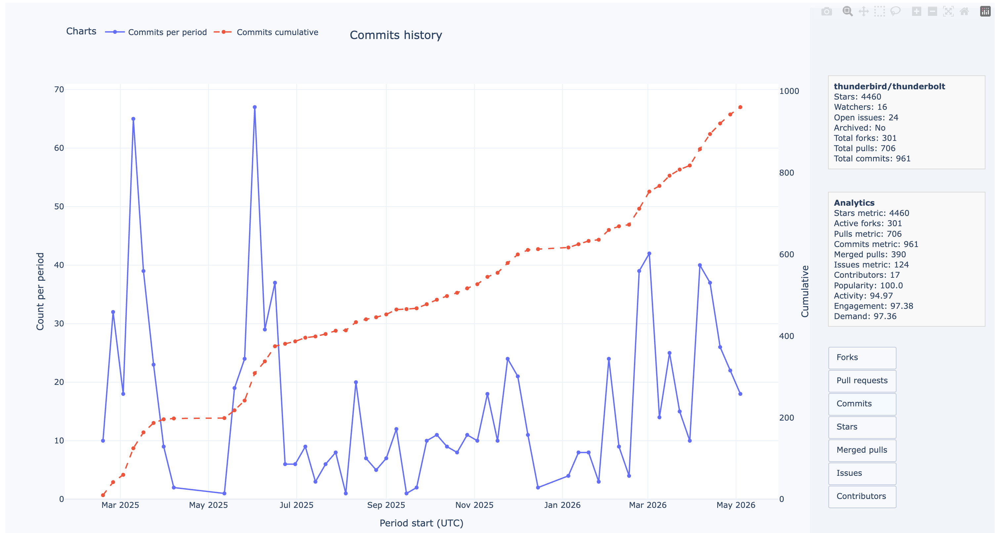
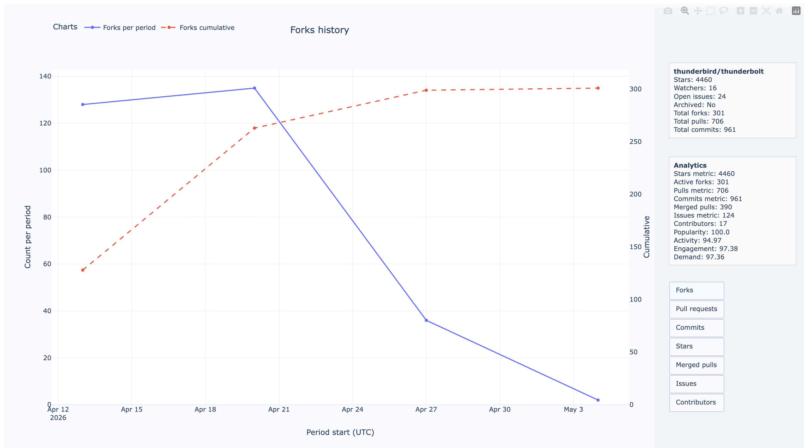

# Repository Parser

Repository Parser - приложение для анализа репозиториев.

Проект собирает историю репозитория, считает агрегированные
метрики, рассчитывает скоринг и формирует интерактивный Plotly-дашборд в HTML.

## Что умеет проект

- Загружает данные о репозитории.
- Собирает историю stars, forks, pull requests, commits, issues и contributors.
- Кэширует историю в локальные JSON-файлы.
- Считает метрики популярности, активности, вовлеченности и итогового спроса.
- Строит интерактивный HTML-дашборд с графиками.
- Запускается локально, через Docker или Docker Compose.

## Пример результата работы

<p align="center">
  
</p>

<p align="center">
  
</p>

## Быстрый старт

Создайте `.env` из примера:

```bash
cp .env.example .env
```

Заполните минимум:

```env
TOKEN=your_github_token
GITHUB_URL=https://github.com/owner/repository
```

Запуск через Docker Compose:

```bash
docker compose build
docker compose run --rm repository-parser
```

После успешного запуска откройте дашборд:

```bash
open repository_analytics_dashboard.html
```

## Локальный запуск

```bash
python3.12 -m venv .venv
source .venv/bin/activate
python -m pip install --upgrade pip
python -m pip install .
python main.py
```

## Основные файлы

```text
main.py                  точка входа
pyproject.toml           зависимости проекта
Dockerfile               Docker-образ
docker-compose.yml       запуск через Docker Compose
.env.example             пример конфигурации
data/csv/kaggle/         CSV-датасет для настройки скоринга
repository_analytics_dashboard.html
                         итоговый HTML-дашборд
```

## Документация

- [Обзор проекта](docs/overview.md)
- [Установка и запуск](docs/installation.md)
- [Конфигурация](docs/configuration.md)
- [Архитектура](docs/architecture.md)
- [Структура проекта](docs/project-structure.md)
- [Docker и Docker Compose](docs/docker.md)
- [Скоринг](docs/scoring.md)
- [Разработка](docs/development.md)
- [Решение проблем](docs/troubleshooting.md)

## Стек
- Python 3.12
- Pydantic
- Pydantic Settings
- HTTPX
- Pandas
- NumPy
- SciPy
- Plotly
- Docker
- Docker Compose
