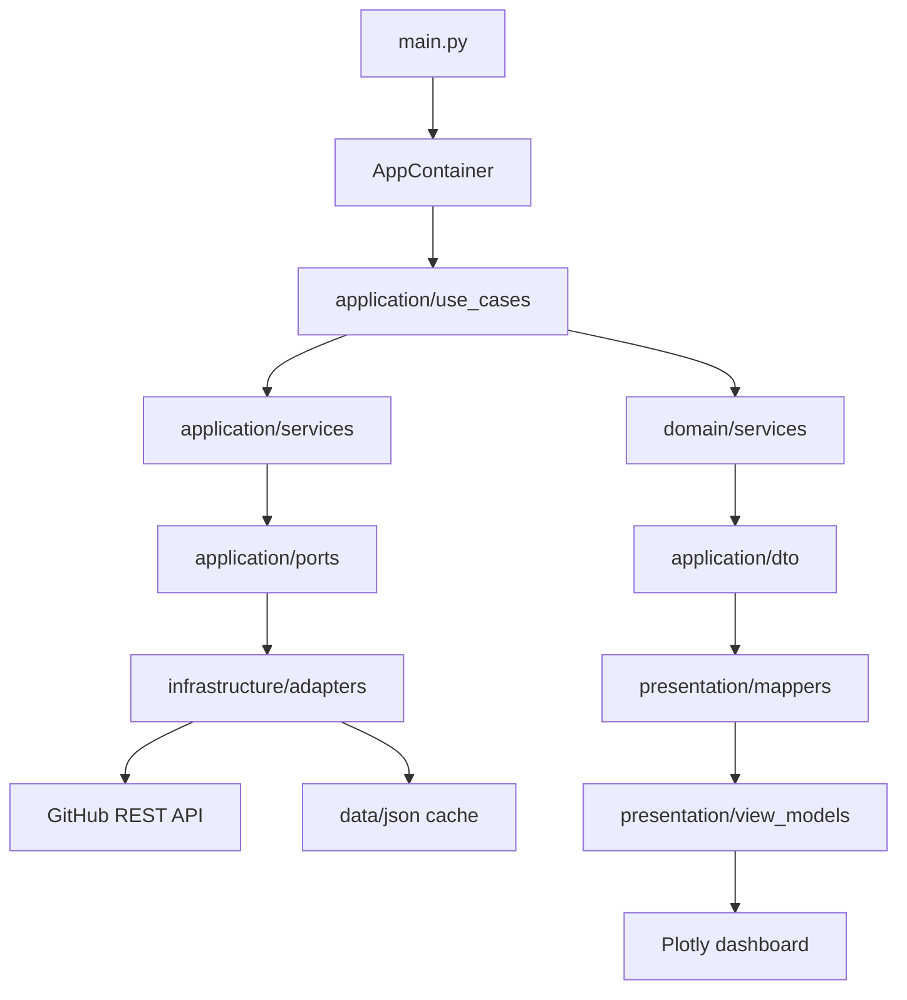

# Repository Parser

Repository Parser is a Python application for collecting GitHub repository
history, calculating repository analytics, and generating an interactive Plotly
dashboard.

The application loads repository data from the GitHub REST API, caches the
history locally, calculates aggregate metrics and score values, then saves an
HTML dashboard with charts for forks, pull requests, commits, stars, merged pull
requests, issues, and contributors.

## Features

- Collects repository metadata from GitHub.
- Loads historical data for:
  - stars;
  - forks;
  - pull requests;
  - merged pull requests;
  - commits;
  - issues;
  - contributors.
- Supports date filtering through the `DAYS` setting.
- Caches GitHub history in local JSON files.
- Reuses fresh cache instead of downloading the same data on every run.
- Calculates aggregate repository metrics.
- Calculates score groups:
  - popularity;
  - activity;
  - engagement;
  - demand.
- Builds score configuration from a Kaggle CSV dataset.
- Generates an interactive Plotly dashboard.
- Supports local Python launch, Docker, and Docker Compose.

## Tech Stack

- Python 3.12
- Pydantic
- Pydantic Settings
- HTTPX
- Pandas
- NumPy
- SciPy
- Plotly
- Docker
- Docker Compose

## Project Structure

```text
Repository-Parser/
  application/
    dto/                 Data Transfer Objects between layers
    ports/               Interfaces used by application services
    queries/             Input query models
    services/            Application services: loading, caching, merging
    use_cases/           Application use cases

  domain/
    entities/            Core repository/history/metrics entities
    services/            Domain services for metrics and scoring
    value_objects/       Typed domain values
    utils.py             Score normalization helpers

  infrastructure/
    adapters/            GitHub and JSON storage adapters
    datasets/            Kaggle-based score configuration provider
    di/                  Composition root / dependency container
    github/              GitHub API client, queries, endpoints, mappers

  presentation/
    chart/               Chart view models
    mappers/             DTO to view model mappers
    plotters/            Plotly figure builders
    ports/               Renderer interfaces
    renders/             Dashboard renderers
    view_models/         Dashboard view models

  data/
    csv/kaggle/          Kaggle dataset used for score calibration
    json/                Runtime cache directory, created automatically

  main.py                Application entry point
  pyproject.toml         Python project metadata and dependencies
  Dockerfile             Docker image definition
  docker-compose.yml     Docker Compose runtime configuration
  .env.example           Example environment configuration
```

## Architecture

The project follows a layered architecture close to Clean Architecture.



Layer responsibilities:

- `domain` contains business models, value objects, and scoring logic.
- `application` coordinates use cases and application services.
- `infrastructure` works with external systems: GitHub API, local JSON cache,
  Kaggle CSV dataset, and dependency composition.
- `presentation` converts analytics into dashboard view models and Plotly
  figures.
- `main.py` wires the application flow together.

## Application Flow

```text
1. main.py reads settings from environment variables or .env.
2. GitHubClient is created with TOKEN.
3. AppContainer builds use cases, services, adapters, and renderers.
4. GetHistoryQuery parses GITHUB_URL into owner and repo.
5. HistoryService tries to load cached history from data/json.
6. If cache is missing or stale, GitHub data is downloaded.
7. History data is filtered by DAYS.
8. CountMetricsService builds aggregate metrics.
9. RepositoryScoringService calculates popularity/activity/engagement/demand.
10. RepositoryDashboardMapper builds dashboard view models.
11. PlotlyRepositoryDashboardRenderer shows and saves the dashboard.
```

The final dashboard is saved as:

```text
repository_analytics_dashboard.html
```

## Requirements

- Python 3.12+
- GitHub Personal Access Token
- Docker and Docker Compose, if you want containerized launch
- Existing Kaggle CSV file:

```text
data/csv/kaggle/github_repos.csv
```

The Kaggle dataset is used to calculate scoring saturations and weights. The
application expects the dataset to contain at least these columns:

```text
stars
forks
contributors
merged_pull_requests
commits
open_issues
closed_issues
is_archived
is_fork
```

## Environment Variables

Create a `.env` file in the project root. You can start from `.env.example`:

```bash
cp .env.example .env
```

Example:

```env
TOKEN=your_github_token
GITHUB_URL=https://github.com/thunderbird/thunderbird
GITHUB_API_URL=https://api.github.com
GITHUB_API_VERSION=2022-11-28
DEFAULT_TIMEOUT=40
DEFAULT_PER_PAGE=100
DEFAULT_RETRIES=4
DAYS=10
HISTORY_CACHE_TTL_SECONDS=3600
```

Settings:

| Variable | Required | Default | Description |
| --- | --- | --- | --- |
| `TOKEN` | Yes | - | GitHub token used as `Bearer` token. |
| `GITHUB_URL` | Yes | - | Repository URL to analyze. |
| `GITHUB_API_URL` | No | `https://api.github.com` | GitHub REST API base URL. |
| `GITHUB_API_VERSION` | No | `2026-03-10` in code | GitHub API version header. |
| `DEFAULT_TIMEOUT` | No | `40` | HTTP request timeout in seconds. |
| `DEFAULT_PER_PAGE` | No | `100` | GitHub pagination page size. |
| `DEFAULT_RETRIES` | No | `4` | Retry count for secondary rate limit responses. |
| `DAYS` | No | `10` | Number of latest days to analyze. |
| `HISTORY_CACHE_TTL_SECONDS` | No | `3600` | Cache freshness time in seconds. |

Do not commit your real `.env` file. It may contain a private GitHub token.

## Local Installation

Create and activate a virtual environment:

```bash
python3.12 -m venv .venv
source .venv/bin/activate
```

Install the project:

```bash
python -m pip install --upgrade pip
python -m pip install .
```

For development tools:

```bash
python -m pip install ".[dev]"
```

Run the application:

```bash
python main.py
```

After a successful run, open the generated dashboard:

```bash
open repository_analytics_dashboard.html
```

On Linux:

```bash
xdg-open repository_analytics_dashboard.html
```

## Docker Usage

Build the image:

```bash
docker build -t repository-parser .
```

Run the container with environment variables from `.env`:

```bash
docker run --rm --env-file .env repository-parser
```

To save `repository_analytics_dashboard.html` and runtime cache files directly
into the project directory on your machine, mount the project folder:

```bash
docker run --rm --env-file .env -v "$PWD:/app" repository-parser
```

Important: `figure.show()` runs inside the container. A Docker container usually
cannot open your host browser directly. Use the generated HTML file instead:

```bash
open repository_analytics_dashboard.html
```

## Docker Compose Usage

The project includes `docker-compose.yml`:

```yaml
services:
  repository-parser:
    build: .
    env_file:
      - .env
    volumes:
      - .:/app
```

Build and run:

```bash
docker compose build
docker compose run --rm repository-parser
```

If dependencies changed, rebuild without cache:

```bash
docker compose build --no-cache
docker compose run --rm repository-parser
```

Or build and run in one command:

```bash
docker compose up --build
```

For this project, `docker compose run --rm repository-parser` is usually the
most convenient command, because the application is a one-time script rather
than a long-running web server.

## Output

The application prints two JSON blocks to the console:

```text
=== HISTORY ===
...

=== ANALYTICS ===
...
```

It also creates:

```text
repository_analytics_dashboard.html
```

The dashboard contains:

- repository summary;
- analytics scores;
- chart selector;
- per-period line chart;
- cumulative line chart.

Available chart groups:

- Forks
- Pull requests
- Commits
- Stars
- Merged pulls
- Issues
- Contributors

## Cache

Historical data is cached in JSON files under:

```text
data/json/{owner}/{repo}/{period}.json
```

Examples:

```text
data/json/python/cpython/days_10.json
data/json/python/cpython/all.json
```

Cache behavior:

- If cache is fresh, the app uses cached history.
- If cache is stale, the app loads only newer GitHub data and merges it with the
  cached history.
- Cache freshness is controlled by `HISTORY_CACHE_TTL_SECONDS`.
- Date filtering is controlled by `DAYS`.

## Scoring Model

The application calculates four score groups:

| Score | Meaning | Inputs |
| --- | --- | --- |
| Popularity | Repository popularity | stars, forks |
| Activity | Development activity | contributors, merged pull requests, commits |
| Engagement | User/project engagement | forks, issues |
| Demand | Final combined score | popularity, activity, engagement |

Scores are normalized to a 0-100 scale.

The scoring configuration is built from:

```text
data/csv/kaggle/github_repos.csv
```

`KaggleScoreConfigProvider` calculates:

- saturation thresholds from percentile values;
- Spearman-correlation-based weights;
- normalized weight groups whose sum equals `1.0`.

## GitHub API Notes

The application uses these GitHub REST API areas:

- repository metadata;
- stargazers;
- forks;
- pull requests;
- commits;
- issues.

For stars, the app uses the GitHub media type that includes `starred_at`, so it
can build a real stars history.

For contributors, the app builds contributor history from commits, because the
GitHub contributors endpoint does not provide the first contribution date.

## Development

Install development dependencies:

```bash
python -m pip install ".[dev]"
```

Run Ruff:

```bash
ruff check .
```

Run tests, if tests are added:

```bash
pytest
```

Recommended import rule for package modules:

- Use direct sibling imports inside the same package.
- Avoid importing sibling classes through package `__init__.py` when that
  package is still being initialized.

For example, inside `presentation/view_models/repository_dashboard.py`, prefer:

```python
from .repository_analytics import RepositoryAnalyticsViewModel
from .repository_summary import RepositorySummaryViewModel
```

This avoids circular import errors caused by partially initialized packages.

## Troubleshooting

### Missing `TOKEN` or `GITHUB_URL`

If you see a Pydantic settings validation error, check that `.env` exists and
contains:

```env
TOKEN=...
GITHUB_URL=...
```

With Docker, pass `.env` into the container:

```bash
docker compose run --rm repository-parser
```

or:

```bash
docker run --rm --env-file .env repository-parser
```

### Browser Does Not Open From Docker

This is expected. Plotly tries to open the browser inside the container, not on
your Mac or host OS.

Use the generated HTML file:

```bash
open repository_analytics_dashboard.html
```

Make sure Docker Compose mounts the project directory:

```yaml
volumes:
  - .:/app
```

### `ModuleNotFoundError: No module named 'scipy'`

Pandas requires SciPy for Spearman correlation:

```python
series.corr(target, method="spearman")
```

Rebuild the image after dependency changes:

```bash
docker compose build --no-cache
docker compose run --rm repository-parser
```

### `httpx.ConnectError`

This usually means the application cannot reach GitHub API.

Check:

- internet connection;
- DNS;
- proxy/VPN settings;
- Docker network access;
- `GITHUB_API_URL`.

### `401 Unauthorized`

The GitHub token is missing, invalid, or expired.

Check:

```env
TOKEN=your_github_token
```

### `403 Rate Limit`

GitHub rate limit may be exhausted. The app retries secondary rate limit
responses, but normal GitHub rate limits may still stop the run.

Possible fixes:

- wait until the limit resets;
- use a valid authenticated token;
- reduce the analyzed period with `DAYS`;
- reuse cache instead of clearing `data/json`.

### Kaggle Dataset Errors

If the app fails while building score config, check that this file exists:

```text
data/csv/kaggle/github_repos.csv
```

Also check that the CSV contains the required scoring columns listed in the
Requirements section.

## Typical Commands

Local run:

```bash
python main.py
```

Docker Compose run:

```bash
docker compose build
docker compose run --rm repository-parser
```

Rebuild after dependency changes:

```bash
docker compose build --no-cache
docker compose run --rm repository-parser
```

Open generated dashboard:

```bash
open repository_analytics_dashboard.html
```

Check Git history:

```bash
git log --oneline --graph --decorate --all
```

