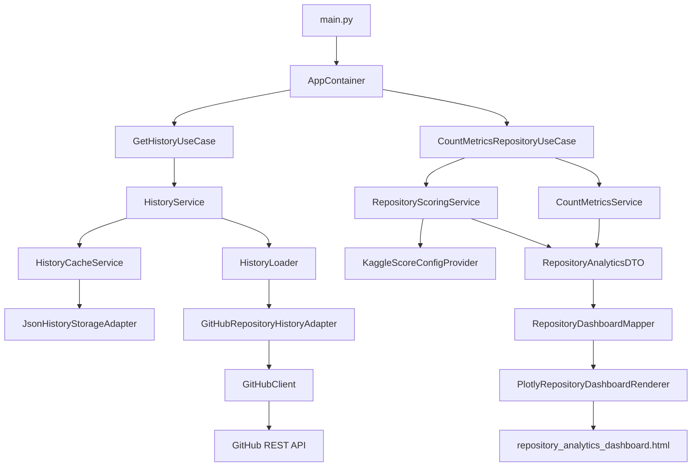

# Архитектура

Проект разделен на слои. Главная идея: бизнес-логика не должна зависеть от
GitHub API, Plotly, Docker или способа хранения кэша.

## Поток данных



## Основной сценарий

1. `main.py` создает `GitHubClient` и `AppContainer`.
2. `AppContainer` собирает все зависимости приложения.
3. `GetHistoryUseCase` запрашивает историю репозитория.
4. `HistoryService` проверяет кэш.
5. Если кэш актуальный, история берется из `data/json`.
6. Если кэш отсутствует или устарел, данные загружаются из GitHub.
7. `CountMetricsRepositoryUseCase` считает аналитику.
8. `RepositoryDashboardMapper` преобразует данные в view model.
9. `PlotlyRepositoryDashboardRenderer` сохраняет HTML-дашборд.

## Направление зависимостей

Код верхних сценариев зависит от интерфейсов и доменных моделей, а внешние детали
вынесены в `infrastructure` и `presentation`.

```text
domain <- application <- infrastructure
domain <- application <- presentation
```

Это позволяет:

- заменить GitHub adapter без переписывания доменной логики;
- заменить JSON-кэш на другой storage;
- заменить Plotly renderer на другой способ отображения;
- тестировать application/domain отдельно от внешних API.

## Роли слоев

### `domain`

Знает, что такое репозиторий, история, метрики и score.

Не должен знать:

- откуда пришли данные;
- где они хранятся;
- как строится HTML;
- как запускается приложение.

### `application`

Описывает сценарии использования:

- получить историю;
- применить кэш;
- обновить устаревшие данные;
- посчитать аналитику.

### `infrastructure`

Содержит конкретные технические реализации:

- HTTP-запросы к GitHub;
- преобразование GitHub JSON в domain models;
- чтение и запись JSON-кэша;
- чтение Kaggle CSV;
- сборка зависимостей в `AppContainer`.

### `presentation`

Отвечает за финальное представление результата:

- view models;
- маппинг аналитики в dashboard;
- построение Plotly-графиков;
- сохранение HTML-файла.

## Кэширование

Кэш нужен, чтобы не загружать одну и ту же историю GitHub при каждом запуске.

```text
data/json/{owner}/{repo}/{period}.json
```

Если кэш свежий, приложение использует его. Если устарел, приложение догружает
новые данные и объединяет их со старой историей.

## Composition Root

`AppContainer` - место, где связываются интерфейсы и реализации.

Именно там решается:

- какой adapter использовать для GitHub;
- где хранить историю;
- откуда брать score config;
- каким renderer строить dashboard.

